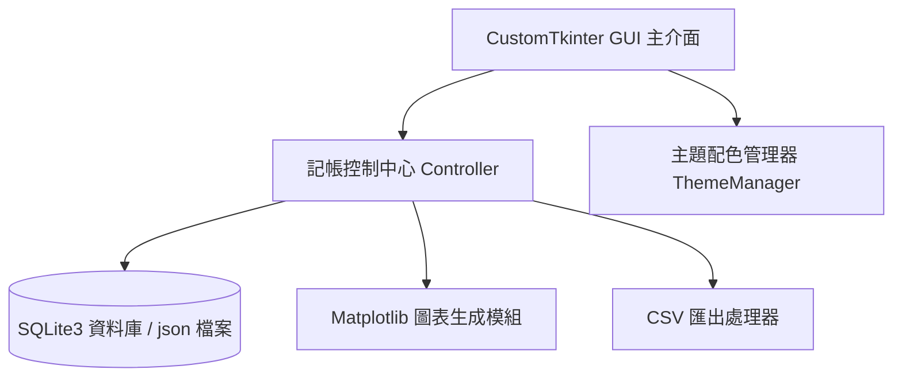

# 專案需求文件 (PRD) - CustomTkinter 個人智能記帳系統 (Smart Ledger)

## 1. 專案背景與願景 (Project Background & Vision)
為了協助使用者更直覺地進行個人財務管理，克服傳統記帳軟體介面複雜或美學不足的問題，本專案將開發一款基於 CustomTkinter 的**「個人智能記帳系統 (Smart Ledger)」**。本系統提供極簡、現代化的桌面 GUI 介面，讓使用者能快速記錄每日收支、設定每月預算上限，並透過直觀的視覺化圖表掌握金流去向，進而培養良好的財務管理習慣。

---

## 2. 目標使用者與場景 (Target Audience & Use Cases)
- **學生與小資族**：需要快速記帳、控管每月預算以避免「月光」的使用者。
- **程式設計期末專題**：整合 Python GUI 排版、資料庫與資料持久化 (SQLite/JSON)、數據統計、圖表繪製 (`matplotlib` 整合) 的實務專題。

---

## 3. 核心功能清單 (Core Features)

### A. 財務儀表板 (Financial Dashboard)
* **實時財務摘要**：頂部亮點卡片顯示當月「總收入」、「總支出」以及「累計結餘 (淨值)」。
* **預算進度條**：以動態進度條 (ProgressBar) 呈現當前花費佔每月預算的比例。進度條顏色會根據使用率動態變化：
  * 安全範圍 (50% 以下)：綠色
  * 警戒範圍 (50% ~ 90%)：黃色
  * 超支狀態 (90% 以上)：紅色
* **近期交易看板**：在主頁顯示最近 5 筆收支明細，支出以紅色符號 (e.g. `-NT$ 150`) 顯示，收入以綠色符號 (e.g. `+NT$ 2,000`) 顯示，並搭配代表性分類符號。

### B. 記帳交易管理 (Transaction Management)
* **快速記帳視窗**：
  * **類型切換**：簡單切換「支出」或「收入」模式。
  * **分類選擇**：內建餐飲、交通、娛樂、購物、醫療、學習、薪資、投資等大類，並支援使用者「自訂新增類別」。
  * **金額與備註**：支援數字輸入防錯驗證（如：禁止輸入字母、負數或符號），並提供可選的備忘錄 (Note) 欄位。
  * **日期選擇**：預設為今天，亦支援點擊日曆或文字框輸入過往日期。
* **交易清單管理**：主頁面提供歷史明細表，使用者可隨時選取任一交易記錄進行「編輯」或「刪除」。

### C. 視覺化統計分析 (Data Analytics & Charts)
* **動態圓餅圖/圓環圖**：利用 `matplotlib` 模組繪製當月各分類支出的比例圖，並無縫嵌入 CustomTkinter 的專屬分頁中。
* **多維度篩選器**：提供月份與年份下拉選單，點擊可立即篩選歷史收支紀錄。
* **分門別類統計**：列表顯示各分類的總支出金額與排序（如：本月餐飲花費最高，佔 45%）。

### D. 預算設定與超支警告 (Budgeting & Alerts)
* **每月預算上限**：允許使用者自由設定每月總支出預算（例如 10,000 元）。
* **超支警告彈窗**：當單筆記帳金額送出後，若導致本月總支出超過預算，軟體會自動跳出提示框警告使用者已超出財務防線。

### E. 資料持久化與匯出 (Data Storage & Backup)
* **本地資料庫**：使用 Python 內建的 `sqlite3` 資料庫或 `json` 格式，安全保存每一筆交易紀錄，確保程式重啟後資料不遺失。
* **CSV 匯出**：提供一鍵「匯出為 CSV 報表」功能，方便使用者將記帳紀錄備份，並能使用 Excel 進行進一步的財務管理。

### F. 設定與個性化 (Settings & Themes)
* **現代感主題切換**：內建「極光綠 (Mint)」、「極簡暗黑 (Classic Dark)」、「櫻花粉 (Sakura)」、「科技藍 (Tech Blue)」主題。
* **貨幣符號自訂**：可自由設定顯示為 `$`、`NT$`、`￥` 等幣值符號。

---

## 4. 系統架構與技術選型 (Technical Architecture)

### 技術棧 (Tech Stack)
* **GUI 框架**：`customtkinter`
* **資料儲存**：`sqlite3` (關聯式本地資料庫，適合進行多條件查詢與統計) 或 `json`
* **統計圖表**：`matplotlib` & `numpy` (用於數據分析與繪圖，將圖表轉換為 Tkinter Canvas 嵌入介面)
* **資料備份**：`csv` (Python 內建庫)

---

## 5. UI/UX 介面設計規劃 (Interface Layout)

### A. 主視窗佈局 (Main Window) - 450x650 像素
1. **左側導覽側欄 (Sidebar)** 或 **頂部導覽列 (Segmented Button)**：
   * `[ 儀表板 ]` `[ 歷史明細 ]` `[ 統計圖表 ]` `[ 系統設定 ]`
2. **儀表板頁面 (Dashboard Page)**：
   * 頂部收支卡片區（本月總收入、總支出、結餘）。
   * 中間預算狀態區（顯示當前預算進度條，超支時變紅）。
   * 下半部「近期交易紀錄」列表（限制顯示最新的 5 筆交易），最底部有醒目的「+ 新增交易」按鈕。
3. **歷史明細頁面 (History Page)**：
   * 提供下拉選單篩選「年」與「月」。
   * 使用滾動區域 (Scrollable Frame) 顯示表格化明細，每筆交易旁附帶編輯與刪除的微型按鈕。
4. **統計圖表頁面 (Charts Page)**：
   * 嵌入 `matplotlib` 的圓環圖，下方顯示各項分類的排行列表與具體金額。
5. **設定頁面 (Settings Page)**：
   * 包含預算設定欄位、主題切換下拉選單、匯出 CSV 按鈕。

---

## 6. 專案開發階段計畫 (Milestones)

* **Phase 1: GUI 主框架與基本分頁**
  * 使用 CustomTkinter 搭建 Sidebar/Segmented Button 與四個主分頁。
  * 實現基本的數位主題配色。
* **Phase 2: 資料庫(SQLite/JSON)與記帳邏輯**
  * 建立資料庫表格結構（包含 id, date, type, category, amount, note）。
  * 實現新增收支的彈出視窗（帶輸入防錯驗證）與資料庫寫入。
* **Phase 3: 儀表板數據運算與預算進度**
  * 撰寫 SQL 查詢以撈取當月總收支與近期交易。
  * 實現預算進度條的動態數值更新與變色邏輯。
* **Phase 4: Matplotlib 圖表整合與明細查詢**
  * 將記帳數據轉換為圓餅圖，嵌入「統計圖表」分頁。
  * 實現歷史明細的年/月篩選、編輯與刪除功能。
* **Phase 5: CSV 匯出與介面微調**
  * 實作匯出為 `CSV` 檔案功能，並加入儲存成功彈窗。
  * 精修 UI 排版、字體與圓角，進行完整的系統流暢度測試。
